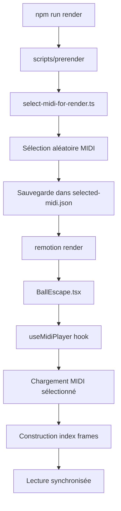

# Système de Musique MIDI de Fond - BallEscape

## Vue d'ensemble

Le système de musique MIDI de fond ajoute une bande sonore dynamique et aléatoire à chaque rendu de la scène `BallEscape`. À chaque exécution de `pnpm render` ou `pnpm remotion`, une musique différente est sélectionnée au hasard parmi une collection de 16 fichiers MIDI.

## Fonctionnalités

### 🎵 Sélection Aléatoire
- **16 fichiers MIDI** disponibles dans `/public/midis/`
- **Sélection automatique** avant chaque rendu
- **Musiques variées** : classique, pop, jeux vidéo, films

### 🎯 Synchronisation Parfaite
- **Lecture frame-based** synchronisée avec Remotion
- **Timing précis** selon les données originales du MIDI
- **Polyphonie complète** (toutes les notes jouées simultanément)

### ⚡ Optimisations Performances
- **Cache intelligent** des notes par frame
- **Indexation pré-calculée** pour éviter les calculs répétitifs
- **Logs réduits** pour de meilleures performances

## Architecture

### Fichiers Clés

#### 1. Script de Sélection
```typescript
// scripts/select-midi-for-render.ts
- Sélectionne aléatoirement un fichier MIDI
- Sauvegarde la sélection dans selected-midi.json
- Exécuté automatiquement par `prerender`
```

#### 2. Service MIDI
```typescript
// src/services/midiService.ts
- Charge et parse les fichiers MIDI
- Convertit en notes jouables
- Gère le cache des fichiers
```

#### 3. Hook Lecteur MIDI
```typescript
// src/hooks/useMidiPlayer.ts
- Gère la lecture synchronisée avec les frames
- Optimise les performances avec l'indexation
- Interface avec le système audio Remotion
```

#### 4. Composant BallEscape
```typescript
// src/remotion/BallEscape.tsx
- Intègre la musique de fond automatiquement
- Affiche le nom du fichier MIDI actuel
- Maintient la synchronisation frame-parfaite
```

### Flux d'Exécution



## Utilisation

### Commandes Principales

```bash
# Sélectionner un nouveau MIDI aléatoire
npm run select:midi

# Effectuer un rendu complet avec nouveau MIDI
npm run render

# Tester le système MIDI
npm run test:midi
```

### Fichiers MIDI Disponibles

1. **AfterDark.mid** - Écran de veille classique
2. **BoMoonlightN12.mid** - Sonate au clair de lune (Beethoven)
3. **BoMoonlightTungstenFilament.mid** - Variation moderne
4. **DespacitoPiano.mid** - Hit pop au piano
5. **FawltyTowers.mid** - Thème de série TV
6. **Flowers.mid** - Mélodie florale
7. **HotelCalifornia.mid** - Classique rock
8. **Hunter x Hunter 2011 - Departure!.mid** - Anime
9. **IllBeGone.mid** - Ballade
10. **JamboreeMladenFranko&HisOrchestra.mid** - Jazz orchestral
11. **PinkPanther.mid** - Thème de film iconique
12. **Pirates of the Caribbean - He's a Pirate.mid** - Aventure épique
13. **Super Mario 64 - Medley.mid** - Nostalgique jeu vidéo
14. **Titantic.mid** - Romance cinématographique
15. **Tokyo Ghoul - Unravel.mid** - Anime intense
16. **Under-The-Sea-(From-'The-Little-Mermaid').mid** - Disney

## Personnalisation

### Ajouter de Nouveaux Fichiers MIDI

1. Placer le fichier `.mid` dans `/public/midis/`
2. Ajouter le nom dans `midiService.ts` → `availableFiles[]`
3. Le fichier sera automatiquement inclus dans la rotation

### Modifier la Fréquence de Lecture

```typescript
// Dans BallEscape.tsx
useEffect(() => {
  if (backgroundMusicStarted && midiPlayer.isInitialized && frame > 0) {
    // Modifier cette condition pour changer la fréquence
    playMusicAtFrame(frame, fps);
  }
}, [frame, backgroundMusicStarted, midiPlayer.isInitialized, playMusicAtFrame, fps]);
```

### Ajuster le Volume

```typescript
// Dans remotionAudioPlayer.ts
this.synth.volume.value = -6; // Changer cette valeur (dB)
```

## Debugging

### Affichage du Fichier Actuel
Le nom du fichier MIDI actuel s'affiche en haut à droite de la vidéo pendant le rendu/preview.

### Logs de Debug
```
[BallEscape] 🎵 Démarrage de la musique MIDI de fond...
[useMidiPlayer] Index des notes créé: 2547 frames avec notes
[useMidiPlayer] 🎵 Frame 30: 4 notes actives
```

### Tests Disponibles
```bash
# Test complet du système
npm run test:midi

# Test de sélection multiple
for i in {1..5}; do npm run select:midi --silent; done
```

## Notes Techniques

### Synchronisation Frame-Based
- Chaque note MIDI est indexée par frame (30fps)
- Les notes sont jouées exactement aux bons moments
- Pas de dérive temporelle

### Optimisations Mémoire
- Cache des fichiers MIDI parsés
- Index pré-calculé des notes par frame
- Évite les recalculs redondants

### Compatibilité Audio
- Fonctionne dans Remotion Studio (preview)
- Compatible avec le rendu vidéo
- Utilise Tone.js pour la synthèse audio

## Résolution de Problèmes

### Audio Silencieux
1. Vérifier que les dépendances sont installées : `npm install`
2. Tester le système : `npm run test:midi`
3. Vérifier la sélection : `cat public/selected-midi.json`

### Fichier MIDI Non Trouvé
1. Vérifier que le fichier existe dans `/public/midis/`
2. Vérifier qu'il est listé dans `midiService.ts`
3. Resélectionner : `npm run select:midi`

### Performances Dégradées
1. Réduire les logs de debug
2. Optimiser l'index des frames
3. Vérifier la mémoire disponible

---

*Système développé pour maximiser la variété musicale et l'engagement des vidéos BallEscape.*